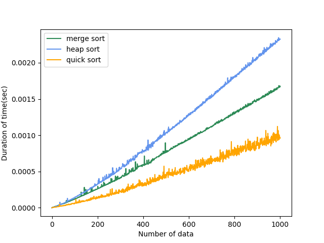

# Sorting Time Test
### Homework of Algorithm lecture(2023 second sememster)
### - Results of sorting time with 0 ~ 10000 random number

### - Results of sorting time with 0 ~ 10000 random number &nbsp;&nbsp;(For comparing merge, heap, quick sort)

